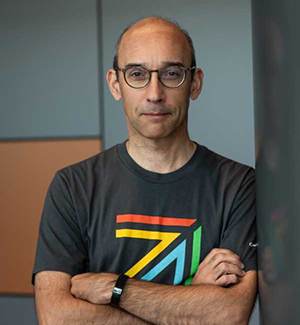

##### 22 May 2024 | Paris-Saclay, France | [EDF Lab Paris-Saclay](https://maps.app.goo.gl/sxxPmcTnYe4Dh3f18)

On 22 May 2024, we will gather in Paris-Saclay, France for OpenInfra Day France where open-source experts and enthusiasts will gather to discuss OpenStack, Kubernetes, and the most relevant infrastructure technologies in the ecosystem.

**[Schedule](https://oideurope2024.openinfra.dev/a/schedule#view=calendar&track=468) | [Register Now](https://oideurope2024.openinfra.dev/#registration=1) | [Sponsor](https://openinfra.dev/events/sponsorship#France)**

### Registration Prices

* Early bird: now - 26 April: 50€
* Regular price: 27 April - 15 May: 70€
* Late bird: 16 May - 22 May: 90€

\*\* Note: accepted speakers will receive a 100% discount code

\*\* Note: refunds and ticket transfers for OpenInfra Day France will be processed until 4 May 2024 at 23:59 PM CET.

## Keynote speakers

<table><tr><td style="max-width:300px;">

</td><td  style="width:5%">&nbsp;</td><td style="max-width:300px;">

</td><td  style="width:5%">&nbsp;</td><td style="max-width:300px;">

</td><td  style="width:5%">&nbsp;</td><td style="max-width:300px;">

</td></tr><tr><td style="max-width:300px;"><b>Laurent GAUTROT</b> Responsable infrastructure cloud Ministère de la Transition Écologique</td><td style="max-width:300px;">&nbsp;</td><td style="max-width:300px;"><b>Thierry Carrez</b> General Manager the OpenInfra Foundation</td><td style="width:5%">&nbsp;</td><td style="max-width:300px;"><b>Nina Landes</b> 
Cheffe de projet interministériel Cloud DINUM (Direction interministérielle du numérique)</td><td style="width:5%">&nbsp;</td><td style="max-width:300px;"><b>Renaud Chaillat</b> 
Directeur du projet Nubo DGFIP</td></tr></table>

\_\_\_\_\_\_\_\_\_\_\_\_\_\_\_\_\_\_\_\_\_\_\_\_\_\_\_\_\_\_\_\_\_\_\_\_\_\_\_\_\_\_\_\_\_\_\_\_\_\_\_\_\_\_\_\_\_\_

## Thank You to Our Sponsors

### Gold Sponsors

<table><tr><td style="max-width:200px;">&nbsp;</td><td style="width:5%">&nbsp;</td><td style="max-width:300px;">

</td><td style="width:5%">&nbsp;</td><td style="max-width:300px;">&nbsp;
</td><td style="width:5%">&nbsp;</td><td style="max-width:300px;">&nbsp;</td></tr></table>

### Media Sponsors

<table><tr><td style="max-width:200px;">&nbsp;</td><td style="width:5%">&nbsp;</td><td style="max-width:200px;">

</td><td style="width:5%">&nbsp;</td><td style="max-width:200px;">

</td><td style="width:5%">&nbsp;</td><td style="max-width:200px;">&nbsp;</td></tr></table>

\_\_\_\_\_\_\_\_\_\_\_\_\_\_\_\_\_\_\_\_\_\_\_\_\_\_\_\_\_\_\_\_\_\_\_\_\_\_\_\_\_\_\_\_\_\_\_\_\_\_\_\_\_\_\_\_\_\_

## Venue

* OpenInfra Day France 2024 will take place at EDF Lab Paris-Saclay, south of Paris.
* The location is reachable via public transport, as well as via car.
* Address is 7 boulevard Gaspard Monge, Palaiseau (pedestrian entry).

\_\_\_\_\_\_\_\_\_\_\_\_\_\_\_\_\_\_\_\_\_\_\_\_\_\_\_\_\_\_\_\_\_\_\_\_\_\_\_\_\_\_\_\_\_\_\_\_\_\_\_\_\_\_\_\_\_\_

## Traveling to OpenInfra Day France

The closest TGV (high-speed train) station is Massy-Palaiseau TGV. Direct trains from the biggest French cities are available. From Massy-Palaiseau station, see below.

If traveling by air, Orly airport is the closest, but both Orly (ORY) and Charles-de-Gaulle (CDG) are on the RER B line (see below).

### Coming by public transport

* From Paris: take RER B or RER C to Massy-Palaiseau station.
* From Massy-Palaiseau RER station: take bus 91.06 (or 91.10) to “Palaiseau - Campus” stop.

(A dedicated bus shuttle may be organized between Massy-Palaiseau RER station and EDF Lab Paris-Saclay - to be confirmed.)

### Coming by car

EDF Lab Paris-Saclay is located close to the N118 road (exit 9).

Car park address is 2 rue Jean Pacilly, Palaiseau.

### Hotels

If you’re coming from far away and would rather spend a night close to the event location, we recommend staying in the Massy-Palaiseau area. Here are some hotels close to the TGV/RER station:

* Hilton Garden Inn Massy
* Hôtel Mercure Paris Massy Gare TGV
* Aparthotel Adagio Access Paris Massy Gare TGV

As an alternative, Aparthotel Adagio Access Palaiseau Saclay, 6 boulevard Gaspard Monge, Palaiseau is within walking distance of EDF Lab Paris-Saclay.