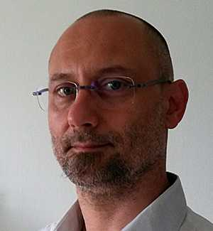
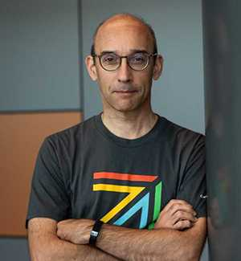
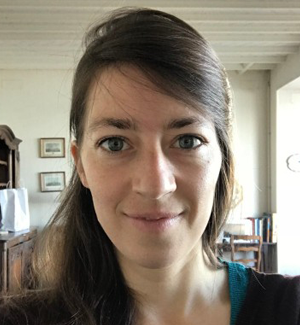

##### 22 May 2024 | Paris-Saclay, France | [EDF Lab Paris-Saclay](https://maps.app.goo.gl/sxxPmcTnYe4Dh3f18)

On 22 May 2024, we will gather in Paris-Saclay, France for OpenInfra Day France where open-source experts and enthusiasts will gather to discuss OpenStack, Kubernetes, and the most relevant infrastructure technologies in the ecosystem.

**[Schedule](https://oideurope2024.openinfra.dev/a/schedule#view=calendar&track=468) | [Register Now](https://oideurope2024.openinfra.dev/#registration=1) | [Sponsor](https://openinfra.dev/events/sponsorship#France)**

### Registration Prices

* Early bird: now - 30 April: 50€
* Regular price: 1 May - 22 May: 70€

Students are eligible for a special ticket price of 30€. Please send a proof, like a student ID, to [admin@openstack.fr](mailto:admin@openstack.fr) in order to receive your discount.

\*\* Note: accepted speakers will receive a 100% discount code

\*\* Note: refunds and ticket transfers for OpenInfra Day France will be processed until 4 May 2024 at 23:59 PM CET.

\*\* Note: for receipts of purchase please contact [admin@openstack.fr](mailto:admin@openstack.fr)

\_\_\_\_\_\_\_\_\_\_\_\_\_\_\_\_\_\_\_\_\_\_\_\_\_\_\_\_\_\_\_\_\_\_\_\_\_\_\_\_\_\_\_\_\_\_\_\_\_\_\_\_\_\_\_\_\_\_

## Event Program

View the event program [here](https://oideurope2024.openinfra.dev/a/schedule#view=calendar&track=468).

### Keynote speakers

<Grid>
  <SpeakerCard name="Laurent GAUTROT" role="Responsable infrastructure cloud Ministère de la Transition Écologique">

  </SpeakerCard>
  <SpeakerCard name="Thierry Carrez" role="General Manager the OpenInfra Foundation">

  </SpeakerCard>
  <SpeakerCard name="Nina Landes" role="Cheffe de projet interministériel Cloud DINUM (Direction interministérielle du numérique)">

  </SpeakerCard>
  <SpeakerCard name="Renaud Chaillat" role="Directeur du projet Nubo DGFIP">
  </SpeakerCard>
</Grid>

### **Language**

Keynotes and most sessions will be in French, but a track will be dedicated to talks in English.

Live translation will be provided for:

* Keynotes into English
* English sessions into French

\_\_\_\_\_\_\_\_\_\_\_\_\_\_\_\_\_\_\_\_\_\_\_\_\_\_\_\_\_\_\_\_\_\_\_\_\_\_\_\_\_\_\_\_\_\_\_\_\_\_\_\_\_\_\_\_\_\_

## Thank You to Our Sponsors

### Platinum Sponsors

<Grid
  minWidth={300}
  style={{
    placeItems: "center",
    paddingTop: "40px",
    paddingBottom: "40px"
  }}
>

</Grid>

### Gold Sponsors

<Grid
  minWidth={250}
  style={{
    placeItems: "center",
    paddingTop: "40px",
    paddingBottom: "40px"
  }}
>

</Grid>

### Silver Sponsors

<Grid
  minWidth={250}
  style={{
    placeItems: "center",
    paddingTop: "40px",
    paddingBottom: "40px"
  }}
>

</Grid>

### Media Sponsors

<Grid
  minWidth={250}
  style={{
    placeItems: "center",
    paddingTop: "40px",
    paddingBottom: "40px"
  }}
>

</Grid>

\_\_\_\_\_\_\_\_\_\_\_\_\_\_\_\_\_\_\_\_\_\_\_\_\_\_\_\_\_\_\_\_\_\_\_\_\_\_\_\_\_\_\_\_\_\_\_\_\_\_\_\_\_\_\_\_\_\_

## Venue

* OpenInfra Day France 2024 will take place at EDF Lab Paris-Saclay, south of Paris.
* The location is reachable via public transport, as well as via car.
* Address is 7 boulevard Gaspard Monge, Palaiseau (pedestrian entry).

\_\_\_\_\_\_\_\_\_\_\_\_\_\_\_\_\_\_\_\_\_\_\_\_\_\_\_\_\_\_\_\_\_\_\_\_\_\_\_\_\_\_\_\_\_\_\_\_\_\_\_\_\_\_\_\_\_\_

## Traveling to OpenInfra Day France

The closest TGV (high-speed train) station is Massy-Palaiseau TGV. Direct trains from the biggest French cities are available. From Massy-Palaiseau station, see below.

If traveling by air, Orly airport is the closest, but both Orly (ORY) and Charles-de-Gaulle (CDG) are on the RER B line (see below). Bus 91-10 (see below) connects Orly airport with EDF Lab directly.

### Coming by public transport

* From Paris: take RER B or RER C to Massy-Palaiseau station.
* From Massy-Palaiseau RER station: take bus **91-06** (or **91-10**) to “Palaiseau - Campus” stop.

**Bus Timetables:**

* [91-06](https://prismic-io.s3.amazonaws.com/portail-idfm-operateurs/fba3706b-f964-4b34-8375-a82f39181b93_Fiche+WEB+ligne+9106+Hiver+2023-2024_+%C3%A0+partir+du+lundi+26+f%C3%A9vrier+2024.pdf): Massy-Palaiseau - EDF Lab (peak hours frequency: 4 to 10 minutes) 
* [91-10](https://ilico.iledefrance-mobilites.fr/uploads/fiches/658c55ca5d0a6_depliant_9110.pdf): (Orly airport) - Massy Palaiseau - EDF Lab (peak hours frequency: 30 minutes)

~~(A dedicated bus shuttle may be organized between Massy-Palaiseau RER station and EDF Lab Paris-Saclay - to be confirmed.)~~

### Coming by car

EDF Lab Paris-Saclay is located close to the N118 road (exit 9).

Public car park “Monge” address is 2 rue Jean Pacilly, Palaiseau. Details, including pricing details, are available at [https://www.effia.com/parking/parking-palaiseau-monge-effia](https://www.effia.com/parking/parking-palaiseau-monge-effia)

### Hotels

If you’re coming from far away and would rather spend a night close to the event location, we recommend staying in the Massy-Palaiseau area. Here are some hotels close to the TGV/RER station:

* Hilton Garden Inn Massy
* Hôtel Mercure Paris Massy Gare TGV
* Aparthotel Adagio Access Paris Massy Gare TGV

As an alternative, Aparthotel Adagio Access Palaiseau Saclay, 6 boulevard Gaspard Monge, Palaiseau is within walking distance of EDF Lab Paris-Saclay.