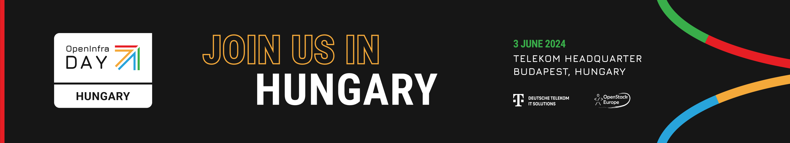
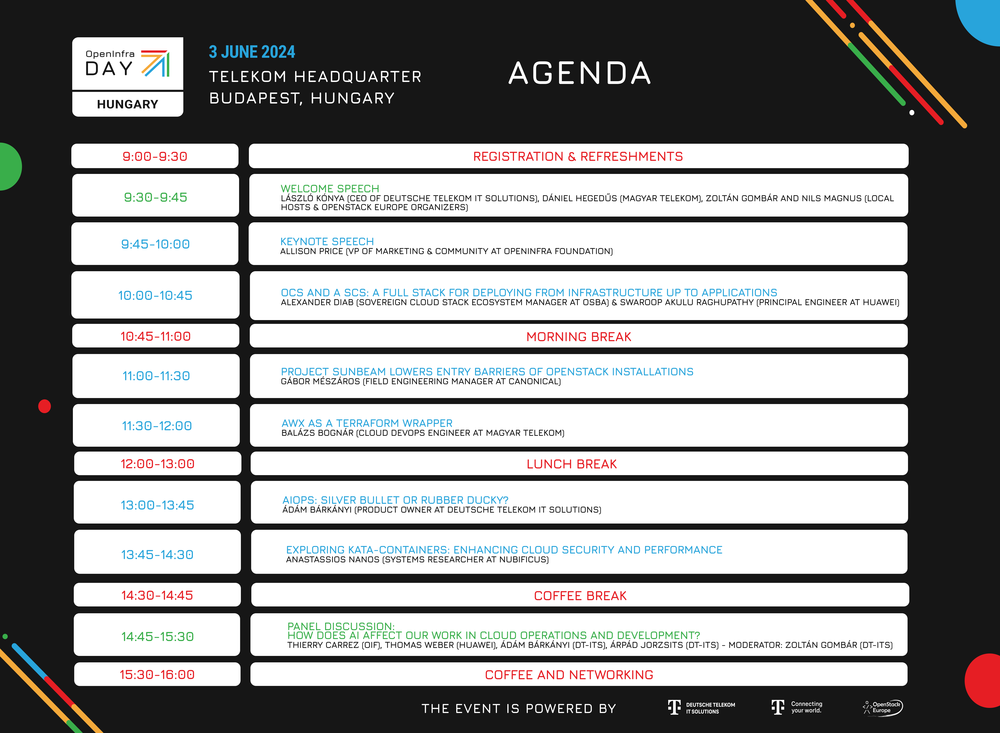

3 June 2024\
Budapest, Hungary\
[Telekom Headquarters, Puskás conference room](https://maps.app.goo.gl/gF5tefAANj1q3zrh8) 

## [Register for FREE](https://oideurope2024.openinfra.dev/#registration=1) | [Schedule](https://oideurope2024.openinfra.dev/a/schedule#view=calendar&track=472)

Organized by the [OpenStack Europe
community](https://www.meetup.com/openstack-europe/) in Hungary, the
OpenInfra Day (formerly OpenStack Day) is back to Budapest! Our open
community aims to discuss all the technologies, tools and features
related to Open Infrastructure, OpenStack and its ecosystem, creating
a place to learn from each other.

The group has an international audience with 230+ members. Join our event in person, learn from our rockstar speakers, exchange valuable experiences and
shape the community!

## Free tech conference, professional networking

On June 3, 2024 we will meet together with our community, sponsors,
OpenInfra representatives, and interested parties in the Puskás
conference center of the the Telekom HQ building in Budapest, Hungary.

Entry to OpenInfra Day Hungary is **FREE**! However, prior registration
for a free ticket is mandatory and seats are limited. The access to the
auditorium of the OpenInfra Day Hungary is barrier-free. If you need
assistance getting to the auditorium, though, please contact us.

## Event Program

[View the interactive Schedule](https://oideurope2024.openinfra.dev/a/schedule#view=calendar&track=472)

OpenInfra Day Hungary is organized in collaboration with the OpenInfra
Foundation and is part of OpenInfra Days Europe, a series of
community-run OpenInfra Days and Meetups in May and June 2024.

## Thank You to our Local Organizers

<table><tr><td style="max-width:300px;">

</td><td style="width:5%">&nbsp;</td><td style="max-width:300px;">

</td></tr></table>

## Data privacy information, Recording, Compliance

By registering I give my consent to the data controllers to collect, process and use my personal data for the purposes of processing my registration and sending a reminder letter.
Data controllers: [OpenInfra Foundation](https://openinfra.dev/privacy-policy) and Deutsche Telekom IT Solutions Hungary Kft (Cg.: 01-09-877517, H-1097 Budapest, Könyves Kálmán krt. 36).

During the event, photo and video recordings will be
taken. These can be published in connection with reporting on the
event on our websites, the websites of our cooperating partners and on
social media channels in order to provide
public information about this event. By registering you
agree to this practice and acknowledge our [Code of
Conduct](https://openinfra.dev/legal/code-of-conduct). Please note, that we will stream the keynote & technical presentations on Webex Webinar, but not the panel discussion. \[During the event photo and video….…]\
\
For any request regarding the described data processing please contact DT-ITS HU on this email: [HU_DT_TSI_CS_BO@t-systems.co](mailto:HU_DT_TSI_CS_BO@t-systems.com)

#### We look forward to a great time together in Budapest!

The OpenInfra Day Hungary team

Kamilla, Eszter, Sára, Zoltán and Nils 

[Register for FREE](https://oideurope2024.openinfra.dev/#registration=1) |
[Schedule](https://oideurope2024.openinfra.dev/a/schedule#view=calendar&track=472)